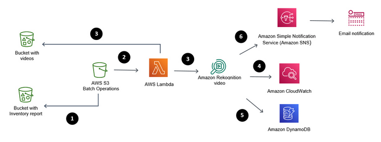

# AWS_ScanVideoS3Rekognition
## Scan Amazon S3 buckets for content moderation using S3 Batch and Amazon Rekognition

Revisando arquitecturas me encontre con [esta](https://aws.amazon.com/es/blogs/machine-learning/scan-amazon-s3-buckets-for-content-moderation-using-s3-batch-and-amazon-rekognition/) super genial, que crea una aplicación capaz de escanear videos alojados Buckets de S3 y con Amazon Rekognition. 

Los servicios involucrados en esta solución son:

### Amazon S3 (Simple Storage Service):
[S3](https://aws.amazon.com/es/s3/) es un servicio de computo sin servidor que le permite ejecutar código sin aprovisionar ni administrar servidores.

### Amazon Rekognition Video:
[Amazon Rekognition Video](https://aws.amazon.com/es/rekognition/video-features/) Amazon Rekognition Video es un servicio de análisis de videos con tecnología de aprendizaje automático que detecta objetos, escenas, celebridades, texto, actividades y cualquier contenido inapropiado en los videos almacenados en Amazon S3. Rekognition Video también proporciona un análisis de rostros muy preciso y funciones de búsqueda de rostros para detectarlos, analizarlos y compararlos; y ayuda a comprender el movimiento de las personas en los videos.

### AWS Lamdba: 
AWS [Lambda](https://aws.amazon.com/es/lambda/) es un servicio de computo sin servidor que le permite ejecutar código sin aprovisionar ni administrar servidores. 

### Amazon DynamoDB:
Amazon [DynamoDB](https://docs.aws.amazon.com/es_es/amazondynamodb/latest/developerguide/Introduction.html) es un servicio de base de datos de NoSQL completamente administrado que ofrece un desempeño rápido y predecible, así como una escalabilidad óptima. DynamoDB le permite reducir las cargas administrativas que supone tener que utilizar y escalar una base de datos distribuida, lo que le evita tener que preocuparse por el aprovisionamiento del hardware, la configuración y la configuración, la replicación, los parches de software o el escalado de clústeres.

### CDK (Cloud Development Kit): 
El kit de desarrollo de la nube de AWS (AWS CDK) es un framework de código abierto que sirve para definir los recursos destinados a aplicaciones en la nube mediante lenguajes de programación conocidos.

Una vez lo conozcas... no vas a querer desarrollar aplicaciones en AWS de otra forma ;)

Conoce más acá: [CDK](https://aws.amazon.com/es/cdk/?nc1=h_ls)