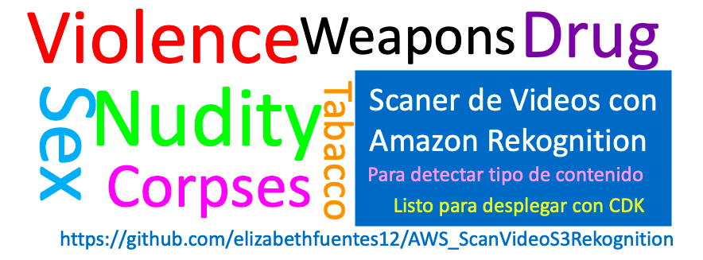

# Scan Amazon S3 buckets for content moderation using S3 Batch and Amazon Rekognition.. CDK deploy



## Introducción

Revisando arquitecturas me encontré con [esta](https://aws.amazon.com/es/blogs/machine-learning/scan-amazon-s3-buckets-for-content-moderation-using-s3-batch-and-amazon-rekognition/) súper genial😱, que crea una aplicación capaz de escanear videos alojados en Buckets de S3 y con operaciones Batch de S3 y Amazon Rekognition permite identificar el tipo de contenido que este contiene. 

Tratar con contenido a gran escala es a menudo desafiante, costoso y una operación pesada. El volumen de contenido generado por usuarios y de terceros ha aumentado sustancialmente en industrias como las redes sociales, el comercio electrónico, la publicidad en línea y el intercambio de medios. Es posible que los clientes deseen revisar este contenido para asegurarse de que cumple con las regulaciones y el gobierno corporativo. Pero necesitan una solución para manejar la escala y la automatización.
 

---

## Arquitectura 🤔 ⚙️


La arquitectura que plantea **Virgil Ennes** en su [publicación]((https://aws.amazon.com/es/blogs/machine-learning/scan-amazon-s3-buckets-for-content-moderation-using-s3-batch-and-amazon-rekognition/)), consiste en 6 partes 


1. El trabajo por Batch de S3 lee el archivo de video.
2. El trabajo por Batch de S3 invoca la función Lambda. 
3. La función Lambda invoca Amazon Rekogintion para realizar la revisión de moderación de contenido en el video. 
4. La actividad se registra en Amazon CloudWatch. 
5. Las etiquetas encontradas por Amazon Rekogintion son almacenadas en una DynamoDB.
6. Amazon SNS envía una notificación por correo electronico. 

---
## Arquitectura Adaptada 🤔 ⚙️ 🧰

Para este playground le hice algunas modificaciones.


1. Al agregar el video en el Bucket **data-bucket** este activa un [Event Notification](https://docs.aws.amazon.com/AmazonS3/latest/userguide/NotificationHowTo.html) que gatilla la Lambda_invokes_Rekognition. **Solo procesa videos en mp4, debes asegurar que sea mp4** 
2. Lambda_invokes_Rekognition invoca Amazon Rekogintion para realizar la revisión de moderación de contenido en el video, con la API *getContentModeration*.
3. Una vez lista la revisión del contenido Amazon Rekogintion notifica a traves de SNS a la lambda Lambda_porcess_Rekognition que esta listo el proceso.
 ***Esto lo modifique debido a que la lamnbda de la arquitectura original no finaliza hasta que Amazon Rekognition informe que el proceso es exitoso, si el video es muy largo la lambda quedará a la espera por mucho tiempo lo cual no es costo efectivo.***  
 4. La Lambda_porcess_Rekognition procesa los resultados de la revision de Amazon Rekognition invocando a **getContentModeration**. 
 5. Las etiquetas encontradas por Amazon Rekogintion son almacenadas en una DynamoDB.
 6. Amazon SNS envía una notificación por correo electronico.

 ---

## Servicios involucrados en la solución son

### Amazon S3 (Simple Storage Service):
[S3](https://aws.amazon.com/es/s3/) es un servicio de computo sin servidor que le permite ejecutar código sin aprovisionar ni administrar servidores.

### Amazon Rekognition Video:
[Amazon Rekognition Video](https://aws.amazon.com/es/rekognition/video-features/) 
Amazon Rekognition le permite analizar imágenes y videos automáticamente en sus aplicaciones y contenido. Proporciona una imagen o un video a la API de Amazon Rekognition, y el servicio puede identificar los objetos, las personas, el texto, las escenas y las actividades, además de detectar cualquier contenido inapropiado.

Amazon Rekognition Video es un servicio de análisis de videos con tecnología de aprendizaje automático que detecta objetos, escenas, celebridades, texto, actividades y cualquier contenido inapropiado en los videos almacenados en Amazon S3. Rekognition Video también proporciona un análisis de rostros muy preciso y funciones de búsqueda de rostros para detectarlos, analizarlos y compararlos; y ayuda a comprender el movimiento de las personas en los videos.

### AWS Lamdba: 
AWS [Lambda](https://aws.amazon.com/es/lambda/) es un servicio de computo sin servidor que le permite ejecutar código sin aprovisionar ni administrar servidores. 

### Amazon DynamoDB:
Amazon [DynamoDB](https://docs.aws.amazon.com/es_es/amazondynamodb/latest/developerguide/Introduction.html) es un servicio de base de datos de NoSQL completamente administrado que ofrece un desempeño rápido y predecible, así como una escalabilidad óptima. DynamoDB le permite reducir las cargas administrativas que supone tener que utilizar y escalar una base de datos distribuida, lo que le evita tener que preocuparse por el aprovisionamiento del hardware, la configuración y la configuración, la replicación, los parches de software o el escalado de clústeres.

### Amazon Simple Notification Service (SNS)
[SNS](https://aws.amazon.com/es/sns/?whats-new-cards.sort-by=item.additionalFields.postDateTime&whats-new-cards.sort-order=desc) es un servicio de mensajería completamente administrado para la comunicación aplicación a aplicación (A2A) y aplicación a persona (A2P).

La funcionalidad de publicación/suscripción A2A brinda temas para la mensajería de alto rendimiento, de muchos a muchos, basada en push entre sistemas distribuidos, microservicios y aplicaciones sin servidores controladas por eventos. Mediante el uso de temas de Amazon SNS, los sistemas de publicadores pueden distribuir los mensajes a una gran cantidad de sistemas de suscriptores, entre otros, colas de Amazon SQS, funciones de AWS Lambda y puntos de enlace HTTPS, para procesamiento paralelo y Amazon Kinesis Data Firehose. La funcionalidad A2P permite enviar mensajes a usuarios a escala a través de SMS, push móvil e email.

### CDK (Cloud Development Kit): 
El kit de desarrollo de la nube de AWS (AWS CDK) es un framework de código abierto que sirve para definir los recursos destinados a aplicaciones en la nube mediante lenguajes de programación conocidos.

Una vez lo conozcas... no vas a querer desarrollar aplicaciones en AWS de otra forma ;)

Conoce más acá: [CDK](https://aws.amazon.com/es/cdk/?nc1=h_ls)

---

## Despliegue 🚀 👩🏻‍🚀

Esta herramienta esta desplegada en *us-east-1*, si quieres cambiar la región debes hacerlo en [scan_video_s3_rekognition.py](https://github.com/elizabethfuentes12/AWS_ScanVideoS3Rekognition/blob/main/ScanVideoS3Rekognition/scan_video_s3_rekognition/scan_video_s3_rekognition_stack.py) 

```python
REGION_NAME = 'tu_region'
```
 
Antes de iniciar debes agregar una dirección de correo valida en [scan_video_s3_rekognition.py](https://github.com/elizabethfuentes12/AWS_ScanVideoS3Rekognition/blob/main/ScanVideoS3Rekognition/scan_video_s3_rekognition/scan_video_s3_rekognition_stack.py)  : 

```python
email="tucorreo@correo.com"
```

**Para crear la aplicación debes seguir los siguientes pasos:**

### 1. Instalar CDK

Para realizar el despliegue de los recursos, debes instalar y configurar la cli (command line interface) de CDK, en este caso estamos utilizando CDK con Python.

[Instalación y configuración de CDK](https://docs.aws.amazon.com/cdk/latest/guide/getting_started.html)

[Documentación CDK para Python](https://docs.aws.amazon.com/cdk/api/latest/python/index.html)


### 2. Clonamos el repo y vamos la carpeta de nuestro proyecto. 

```bash
git clone https://github.com/elizabethfuentes12/AWS_ScanVideoS3Rekognition
cd AWS_ScanVideoS3Rekognition/ScanVideoS3Rekognition
```

### 3. Creamos e iniciamos el ambiente virtual

```bash
python3 -m venv .venv
source .venv/bin/activate
```

Este ambiente virtual (venv) nos permite aislar las versiones del python que vamos a utilizar como también de librerías asociadas. Con esto podemos tener varios proyectos con distintas configuraciones.

### 4. Explicación del código

En el GitHub esta el código listo para desplegar, a continuación una breve explicación:

**Lambdas:**
+ [lambda_invokes_rekognition](https://github.com/elizabethfuentes12/AWS_ScanVideoS3Rekognition/blob/main/ScanVideoS3Rekognition/lambda_invokes_rekognition/lambda_function.py) : Lambda que invoca Amazon Rekogintion para realizar la revisión de moderación de contenido en el video, con la API *getContentModeration* y subscribe al SNS Topic para que se notifique una vez termine la revisión.

```bash
startModerationLabelDetection = rekognition.start_content_moderation(
            Video={'S3Object': {
                'Bucket': bucket1, 
                'Name': filename, }
                },
            ClientRequestToken=userIdentity,
            NotificationChannel={
            'SNSTopicArn': SNS_REKOGNITION,
            'RoleArn': SNS_ROLE_ARN_REKOGNITION
                                },
            JobTag=userIdentity)
```

Puedes informarte más sobre esta API en la documentación: 
https://docs.aws.amazon.com/cli/latest/reference/rekognition/start-content-moderation.html
https://boto3.amazonaws.com/v1/documentation/api/latest/reference/services/rekognition.html#Rekognition.Client.start_content_moderation

* [lambda_process_Rekognition](https://github.com/elizabethfuentes12/AWS_ScanVideoS3Rekognition/blob/main/ScanVideoS3Rekognition/lambda_process_Rekognition/lambda_function.py) : Lambda que procesa los resultados de la revision de Amazon Rekognition invocando a **getContentModeration**, 

```bash
getContentModeration = rekognition.get_content_moderation(
            JobId=moderationJobId,
            SortBy='TIMESTAMP')
```

escribe en DynamoDB

```bash 
table.put_item(
                    Item={
                        "Id": str(uuid.uuid4()),
                        'Timestamp': timestamp,
                        "Jobtag" : request["JobTag"],
                        'Confidence': str(round(conf_level, 1)),
                        'Name': name,
                        'ParentName': parent,
                        'Video': filename,
                        'Date': str(datetime.datetime.now())
                    })
```

y envia el correo con SNS. 
```bash
message = client.publish(TargetArn= SNS_ARN, Message=mailer,
                                    Subject='Amazon Rekognition Video Detection')
```

### 5. Instalamos los requerimientos para el ambiente de python 

Para que el ambiente pueda desplegarse, debemos agregar todas las librerías CDK necesarias en el archivo  [requirements.txt](https://github.com/elizabethfuentes12/AWS_ScanVideoS3Rekognition/blob/main/ScanVideoS3Rekognition/requirements.txt)


```zsh
pip install -r requirements.txt
```

### 6. Desplegando la aplicación

Previo al despliegue de la aplicación en AWS Cloud debemos asegurarnos que este sin errores para que no salten errores durante el despliegue, eso lo hacemos con el siguiente comando que genera un template de cloudformation con nuestra definición de recuersos en python.

```bash
cdk synth
```

Si hay algún error en tu código este comando te indicara cual es con su ubicación.  

En el caso de estar cargando una nueva version de la apliación puedes revisar que es lo nuevo con el siguiente comando: 

```
cdk diff
```

Procedemos a desplegar la aplicación: 

```
cdk deploy
```

### 7. Tips


El despliegue lo utiliza utlizando las credenciales por defecto de AWS, si desea usar un profile específico agrege --profile <nombre> al comando deploy:

```
cdk deploy --profile mi-profile-custom
```

o simplemente exporte en una variable de entorno

```
export AWS_PROFILE=mi-profile-custom
cdk deploy
```
### 8. Eliminar el stack de la aplicación

Para eliminar el stack lo puedes hacer via comando:

```
cdk destroy
```

ó via consola cloudformation, seleccione el stack (mismo nombre del proyecto cdk) y lo borra.

## ¡¡Happy developing 😁!!

----

## Adicional

* Te dejo este proyecto más grande que te puede interesar 

https://github.com/aws-samples/amazon-rekognition-serverless-large-scale-image-and-video-processing

* Una solución que puedes agregar al princio que convierta el video previamente a formato mp4

[AWS Elemental MediaConvert](https://aws.amazon.com/es/mediaconvert/)

* La arquitectura original

https://aws.amazon.com/es/blogs/machine-learning/scan-amazon-s3-buckets-for-content-moderation-using-s3-batch-and-amazon-rekognition/
